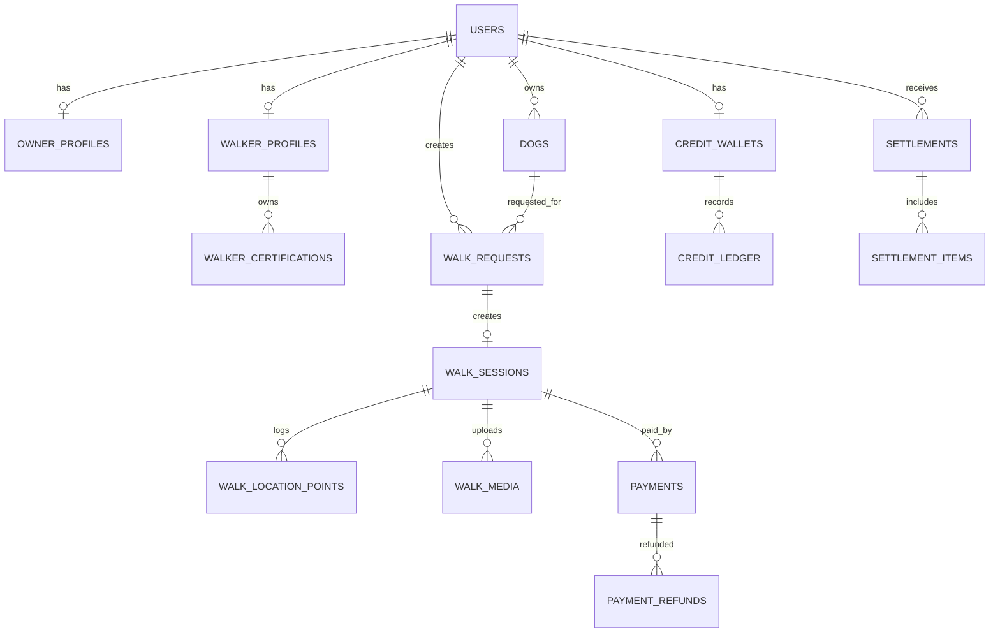

# DogWalk ERD 초안

## 1. 핵심 엔티티
- users
- owner_profiles
- walker_profiles
- walker_certifications
- dogs
- walk_requests
- walk_sessions
- walk_location_points
- walk_media
- payments
- payment_refunds
- settlements
- settlement_items
- credit_wallets
- credit_ledger

## 2. 관계 요약
- users (1) --- (1) owner_profiles
- users (1) --- (1) walker_profiles
- walker_profiles (1) --- (N) walker_certifications
- users(owner) (1) --- (N) dogs
- users(owner) (1) --- (N) walk_requests
- dogs (1) --- (N) walk_requests
- walk_requests (1) --- (0..1) walk_sessions
- walk_sessions (1) --- (N) walk_location_points
- walk_sessions (1) --- (N) walk_media
- walk_sessions (1) --- (N) payments
- payments (1) --- (N) payment_refunds
- users(walker) (1) --- (N) settlements
- settlements (1) --- (N) settlement_items
- users (1) --- (1) credit_wallets
- credit_wallets (1) --- (N) credit_ledger

## 3. Mermaid ERD (텍스트)

## 4. 인덱스 권장
- users(phone), users(email)
- dogs(owner_user_id)
- walk_requests(owner_user_id, status, scheduled_start_at)
- walk_sessions(walker_user_id, status, start_at)
- walk_location_points(session_id, recorded_at)
- payments(order_no), payments(provider_tx_id)
- credit_ledger(wallet_id, created_at)
